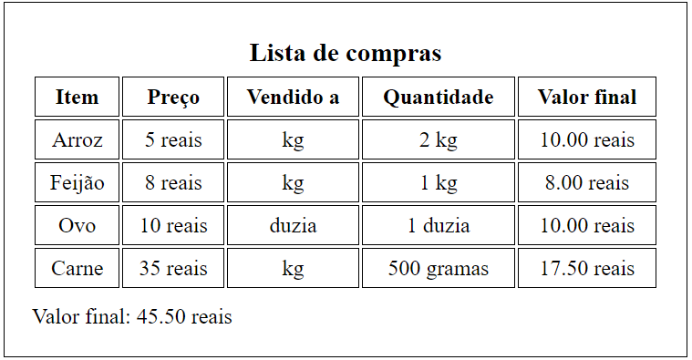

# Sobre

- Esse projeto não está incluso nas aulas, mas é algo a parte que estou montando na intenção de treinar de forma prática o que está sendo estudado. Na aula passada está o conteúdo aprendido... já aqui irei montar e anotar sobre o projeto, além de incrementar conteúdos a mais que vale a pena comentar.


## 📰 O projeto

- Esse projeto contempla o primeiro uso prático de integração de um `servidor local + frontend` em algo interessante, sendo uma lista de supermercado que recebe dados do servidor e os renderiza. Essa é a primeira versão, posterioremente irei criar outra usando esta como base, mas integrada com outros métodos HTTP para gerar mais funcionalidades a ela, como adicionar, editar e apagar itens. Foco aqui não é em beleza e nem entrega de produto, mas aprender mais e aplicar de forma engajante o que venho estudado.

<div style="display: flex; justify-content: center; width:500px">
	<h3>Demonstrativo visual final do projeto</h1>
	
</div>

### 📥 Para rodar o projeto na sua máquina

```
1. Clone o repositório:
>> git clone https://github.com/IsaqueSSNogueira/node-study.git

2. Acesse a pasta do projeto:
>> cd Node.js\stack-mobile_course\06)shopping_list_project_1\back

3. Instale as dependências do backend:
>> npm install

4. Inicie o servidor:
>> node server.js

5. Abra o frontend:
- Abra o arquivo HTML com o Live Server (recomendado)
ou
- Abra manualmente no navegador

6. Acesse no navegador:
O frontend irá consumir a API em:
http://localhost:3000
```

<br>

## 🧩 Conteúdo a mais

- `forEach` não funciona em `async/await`, ele não espera. Utilize loop `for`:

```
for (const item of itens) {
	const res = await fetch("...")
	const data = await res.json()
	...
}
```

### 🕵️‍ CORS

- Durante o projeto, a requisição não estava sendo bem-sucedida, pois o navegador bloqueava o acesso à API quando o frontend era executado localmente (file://);
- Para resolver isso, é possível rodar o frontend em um servidor (ex: Live Server) ou habilitar o CORS no backend.
- O CORS (Cross-Origin Resource Sharing) é um mecanismo de segurança implementado pelos navegadores que controla quais origens podem acessar recursos de uma API.
- Para instalar, no projeto: `npm install cors`;
- No backend:
```
import express from "express"
import cors from "cors"

const app = express();

app.use(express.json())
app.use(cors())
```


### 🔍 Pontos

- Códigos dentro de uma `função async` muitas vezes só são rodados quando a promessa retorna, podendo travar os debaixo.

<br>

## 🧠 Relembrando

### HTML 

- Tabelas:
```
1. table;
2. caption;
3. thead, tbody, tfoot (se tentar envolver com div, ele quebra);
4. tr (linha);
5. (células) - th (para titulos), td (conteúdo, rodapé).
``` 

### JS 

- createElement/appendChild (exemplo):
```
data.forEach((item) => {
	const row = document.createElement("tr")
	row.innerHTML = `
		<td>${item.nome}</td>
		<td>${item.valor} reais</td>
		<td>${item.vendidoA}</td>
		<td>${quantily}</td>
		<td>${valueTotal} reais</td>
	`
	contentContainer.appendChild(row)
})
```
- `toFixed(X)` : Força ter "X" casa decimais. 