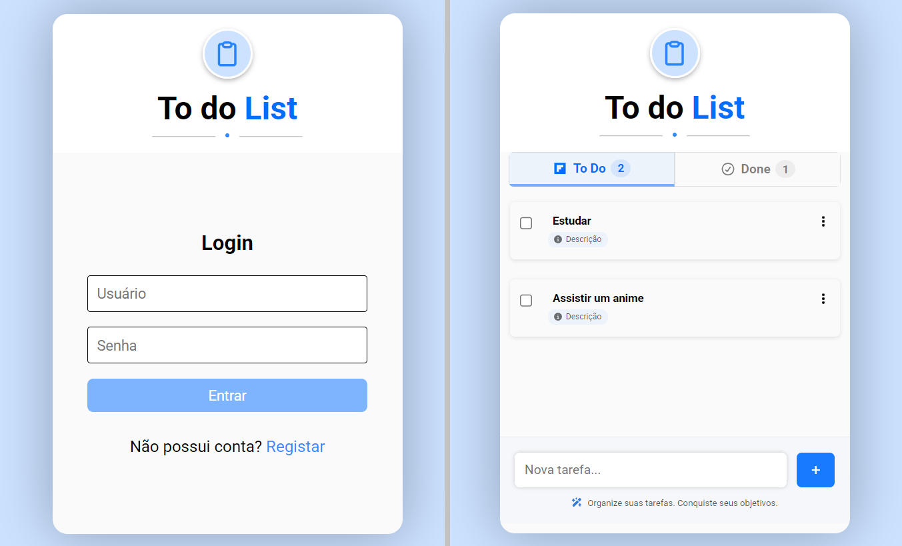

# 🌆 Separação de arquivos (BACKEND - parte 2)

- Foco em separação de arquivo, melhor estruturação e recursos conforme o projeto escala.

### Demonstrativo visual final do projeto




## 🗃 Organização dos arquivos

- server;
- app;
- routes;
- controllers;
- middleware básico.


### 🗂 Separação 
```
src/
│
├── server.js          // ponto de entrada
├── app.js             // configurações do express
│
├── routes/
│   └── taskRoutes.js
│
├── controllers/
│   └── taskController.js
│
├── services/
│   └── taskService.js
│
├── models/
│   └── taskModel.js   // (se usar banco)
│
├── middlewares/
│   └── errorMiddleware.js
│
└── utils/
```

## 1) Server.js

- Mínimo possível; 
- Ele inicia o servidor:
```
// server

import app from "app.js"

const PORT = 3000;

app.listen(PORT, () => {
	console.log(`Servidor rodando na porta ${PORT}`)
})

```


<br>


## 2) App.js

- Configuração do Express;
- Onde centraliza middlewares (exemplo: `express.json()`, `cors()`) e rotas:

```
import express from "express"
import taskRoutes from "routes/taskRoutes.js"

const app = express()

app.use(express.json())

app.use("/tasks", taskRoutes)

export default app;
```

<br> 

### 🔀 O que é `app.use()` ?

(base)
- Ele conecta algo no fluxo da requisição;
- Pode definir middlewares ou um conjunto de rotas;
-  O que acontece aqui `app.use("/tasks", taskRoutes)` - Significa: “Toda requisição que começar com /tasks, manda pro taskRoutes”;
- Fluxo: 

1) server;
2) app.js; → app.use("/tasks", taskRoutes);
3) taskRoutes → router.get("/") ;
4) controller;

(final)
- **Usado para middlewares e agrupamento de rotas, ele define "toda requisição que passar por aqui, executa isso".**;
- **Agrupando rotas, ele define "executa esse agrupamento de rotas se a requisição partir da url "X" (/tasks, por exemplo)**;
- **Já se for métodos específicos, como `app.get` (para ilustração), ele vai ver a url e ver se o método especifico bate. Na prática é url > metódo, mas o foco é "os dois estão alinhados? url e método?"**.


<br>


## Routes

- Ele define qual controller será chamado confome o método;
- Define o `router` a partir do `express.Router()` (assim como cria o app como instância do servidor);
- Nele que é definido o método, caminho pode ser `/` pq é relativo de quem repassa a requisição (no caso, `app.use("/tasks", taskRoutes)`);
- Nele é importado e repassado os respectivos controllers pra cada chamado, assim como a url define quais conjunto de rotas será chamado, os métodos definem quais controls irão dar seguimento daqui pra frente;
- Aliás, em termos de construção da aplicação, após aqui não há retorno vindo pra esses arquivos, eles são "selados" após a requisição chegar na etapas dos controls, os quais irão fechar a requisição enviando o `response`;

```
import express from "express";
import { getTasks, createTask } from "../controllers/taskController.js";

const router = express.Router();

router.get("/", getTasks);
router.post("/", createTask);

export default router; // por ser default, ele pode ser chamado como taskRoutes no app.js
```

- Para diferenciar um parâmetro dinâmico de um parâmetro padrão, basta ter `/:`, tipo: `/:id/tasks/id` virá comoo `users/1234/tasks/9876`;
- Parâmetros são passados pelo `router` e não pelo `app`, o app define apenas a url base.


<br>

### Analogia

- Url atrelada já foi definida no app.js, aqui é uma segunda triagem;
- Tipo como em um hospital:
1) 🚪 `server` seria a entrada;
2) 🧭 `app` seria a primeira triagem, dividida para tipo de paciente (clinico, pediatrico) que seria a url;
3) 📋 E direciona para tal médico que com a análise feita (métodos http, get, post, patch, put, delete - ou o próprio `routes`);
4) ↩ Routes faz a segunda triagem e direciona para o especialista conforme o método, que é o `controls`;
5) 👨‍⚕️ Controls não resolve o problema em si com as próprias mãos, mas orquestra a solução através dos tratamentos (services) e ele dá a avaliação de retorno (recebem req, chamam service, retornam res);
6) 💊 O problema é resolvido com os tratamentos, que seria os `services`, os quais o controls indica e retorna o "feedback" se o tratamento está funcionando ou não (os return `status()`). Os services contêm as regra de negócio;


<br>


## Controls

- Camada do meio;
- Pega `req`, chama o `service`, devolve o `res`;
- Define lógica de fluxo, mas não regra de negócio pesada (nisso é chamado o service);

```
import * as userService from "../services/userService.js"

export const getUser = (req, res) => {
  const { id } = req.params

  const user = userService.findUserById(id)

  if (!user) {
    return res.status(404).json({ message: "Usuário não encontrado" })
  }

  return res.json(user)
}
```

- `*`: Importa tudo desse arquivo como objeto;
- `as ...`: Coloca tudo nesse nome;
- Exemplo: `import * as userService from "../services/userService.js"`;

```

// se no service você tem:

export const findUserById = () => {}
export const createUser = () => {}


// então no controller fica 

userService.findUserById()
userService.createUser()
```


<br>


### Service

- Onde a lógica real acontece, a chamada regra de negócio;
- Aqui você mexe nos dados (array, banco, etc);
- Cálculos, validações, manipulação de dados, busca no banco ou array;
- Baseado muito em return para o controller;

```
// encontrar usuário

import { users } from "../data/users.js"

export const findUserById = (id) => {
  return users.find(user => user.id === id)
}
```

```
// atualizar tarefa

import { users } from "../data/users.js"

export const updateTask = (userId, taskId, data) => {
  const user = users.find(u => u.id === userId)
  if (!user) return null

  const task = user.tasks.find(t => t.id === taskId)
  if (!task) return null

  if (data.text !== undefined) task.text = data.text
  if (data.description !== undefined) task.description = data.description
  if (data.isChecked !== undefined) task.completed = data.isChecked

  return task
}
```

<br>


